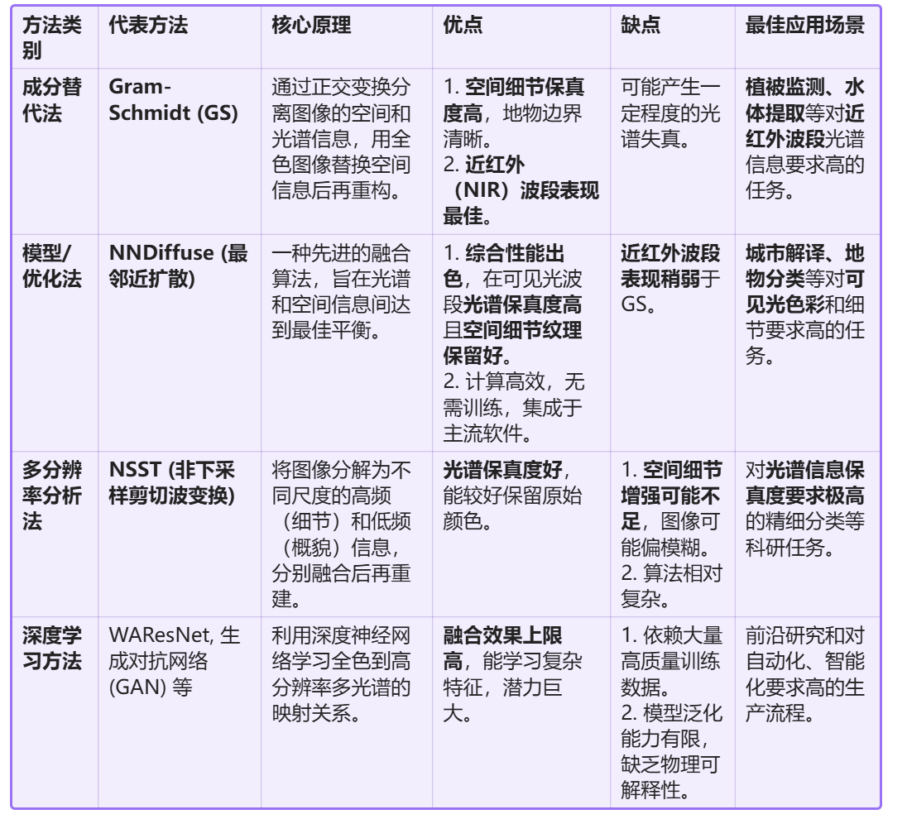

# GF-7 卫星影像处理完整学习手册

> 从波段认知到影像融合的端到端处理流程
>
> 卫星型号：高分七号（GF-7）｜传感器：BWDPAN / BWD_MUX / FWDPAN｜工具：ENVI / GDAL
>
> 整理自 Word 学习手册（2026 年 8 月），补充完善表格与结构。

---

## 一、GF-7 卫星波段系统

高分七号（GF-7）是我国首颗**亚米级立体测绘卫星**，搭载了双线阵立体相机和激光测高仪，能够实现 1:10000 比例尺立体测图。其核心载荷包括两个全色波段和一个多光谱传感器。

### 1.1 前视与后视：GF-7 的"双眼"

GF-7 的全色成像系统由两台不同视角的相机组成，形成立体观测能力：

- **FWDPAN（前视全色）**：由前视相机获取，在卫星飞行时朝向前方倾斜约 **+26°** 拍摄，分辨率 **0.8 米**。
- **BWDPAN（后视全色）**：由后视相机获取，在卫星飞行时朝向后方倾斜约 **-5°** 拍摄，分辨率 **0.65 米**。后视相机同时搭载了多光谱传感器（BWD_MUX）。

两个相机同步工作，从不同角度对同一地面目标拍摄，形成**立体像对**——类似于人的双眼通过视差构建三维感知。

### 1.2 参数对比

| 特性 | FWDPAN（前视） | BWDPAN（后视） |
|---|---|---|
| 全称 | Panchromatic Forward | Panchromatic Backward |
| 相机倾角 | 约 +26°（朝飞行前方） | 约 -5°（朝飞行后方） |
| 光谱范围 | 0.45–0.90 μm | 0.45–0.90 μm |
| 空间分辨率 | 0.8 米 | 0.65 米 |
| 波段数量 | 仅全色（单波段） | 全色 + 多光谱（同机搭载） |
| 成像特点 | 视角大，擅捕捉建筑立面、山体侧面 | 视角接近垂直，地形畸变小 |
| 主要用途 | 立体测绘前视角数据，构建 DSM/DEM | 正射影像生产、地物解译、多光谱融合 |

### 1.3 核心结论

FWDPAN 与 BWDPAN 是一对功能互补的搭档：FWDPAN 擅长捕捉物体的"侧面"，是构建三维模型的主力；BWDPAN 分辨率更高、视角更正，是制作正射影像和进行地物分类的"多面手"。两者结合可实现 1:10000 比例尺的立体测图要求。

---

## 二、RPC 有理多项式系数模型

RPC（Rational Polynomial Coefficients，有理多项式系数）是描述卫星传感器成像几何关系的数学模型，它将影像像素位置与地面真实坐标之间建立数学转换关系。

### 2.1 为什么需要 RPC？

卫星拍摄地面时并非垂直拍摄，而是受到多种因素的综合影响：卫星轨道位置、姿态角（俯仰/滚动/偏航）、传感器安装角、地球曲率和地形起伏。这些因素导致原始影像的像素位置与真实地理位置之间存在系统性偏差，可达**几十米甚至上百米**。RPC 就是卫星厂家提供的一组数学参数，让软件能够将"拍歪了"的照片纠正成"从正上方看"的精确地图。

### 2.2 RPC 文件的格式

| 格式 | 说明 |
|---|---|
| `.rpb` | GF-7 最标准的 RPC 格式，内含 LINE_OFF、SAMP_OFF 以及各 20 个分子/分母多项式系数（共约 90 个参数）。ENVI、PCI 等软件可直接读取。 |
| `.xml`（内嵌） | 部分产品将 RPC 参数直接写在 XML 元数据文件中，软件读取时自动提取。 |
| `.rpc` | 纯文本格式，内容与 `.rpb` 一致，仅扩展名不同。 |

### 2.3 RPC 文件的核心功能

- **几何精校正**：将原始影像纠正到正确的经纬度或投影坐标位置。
- **正射校正**：结合 DEM 消除地形起伏引起的投影变形和倾斜视角造成的几何畸变。
- **立体测绘**：GF-7 的 FWDPAN 和 BWDPAN 各有独立 RPC，通过立体匹配生成高精度 DSM/DEM。
- **融合前位置统一**：确保多光谱和全色影像在同一坐标系下精确对齐，避免融合后的"晕边"和"重影"。

> ⚠️ **重要注意事项**：每个传感器/波段的 RPC 文件是根据该传感器特定的成像时间、相机参数和观测角度独立解算生成的。**RPC 文件严禁混用**——BWDPAN 必须使用其同名 `.rpb` 文件，BWD_MUX 亦然。混用 RPC 会导致几何校正结果错误（偏移可达数百米）。

### 2.4 GF-7 标准数据产品结构

从官方或授权渠道获取的 GF-7 标准产品通常包含以下文件：

```
GF7_xxx/
├── GF7_xxx_BWDPAN.tiff    ← 后视全色影像（0.65m）
├── GF7_xxx_BWDPAN.rpb     ← 后视全色 RPC 参数
├── GF7_xxx_BWDPAN.xml     ← 后视全色元数据
├── GF7_xxx_BWD_MUX.tiff   ← 后视多光谱影像（~3.2m）
├── GF7_xxx_BWD_MUX.rpb    ← 后视多光谱 RPC 参数
└── GF7_xxx_BWD_MUX.xml    ← 后视多光谱元数据
```

拥有 `.rpb` 文件即意味着 RPC 参数已经具备，可以直接在专业软件中开展正射校正和后续处理。

---

## 三、地面控制点（GCPs）

地面控制点（GCP，Ground Control Point）是影像坐标与真实地理坐标之间的一一匹配点，用于几何精校正。在拥有 RPC 文件的一般情况下，GCP 不是必需的，但在提升定位精度、检验 RPC 效果或处理缺少 RPC 的数据时，GCP 仍然不可或缺。

### 3.1 RPC 与 GCP 的区别

| 对比维度 | RPC（有理多项式系数） | GCP（地面控制点） |
|---|---|---|
| 来源 | 卫星厂家随数据提供 | 用户根据参考数据自行获取 |
| 形式 | 一组固定的多项式系数（约 90 个参数） | 若干个离散的点位坐标 |
| 获取成本 | 低（随产品附带） | 较高（需外业测量或内业采集） |
| 精度 | 较高（GF-7 官方约 5–10 米） | 取决于采集方式（最高可达厘米级） |
| 适用场景 | 常规正射校正 | 精度提升、精度验证、无 RPC 时的替代校正 |

> 简单理解：RPC 是卫星厂家告诉你"相机在太空中如何拍摄"；GCP 是你告诉软件"地面上这些点的真实位置在哪里"。两者关系是 **RPC 为基础，GCP 为优化**。

### 3.2 GCP 获取方式

| 方法 | 说明 | 精度 |
|---|---|---|
| 已校正影像提取 | 从天地图、Google Earth、省级高精度 DOM 等参考影像上寻找同名点 | 亚米级至 5–10 米 |
| 矢量数据提取 | 从 OpenStreetMap、国家基础地理信息中心等矢量数据中读取坐标 | 取决于矢量精度 |
| GPS/GNSS 实地测量 | 使用 RTK-GNSS（厘米级）或手持 GPS 实地采集 | 厘米级至米级 |
| 官方控制点数据库 | 从全国地理信息资源目录服务系统（data.ngcc.cn）等申请 | 官方权威精度 |

### 3.3 GCP 选择原则

好的 GCP 应具备：**地物明显**（影像上清晰可辨）、**地物稳定**（不随时间季节变化）、**特征尖锐**（有明确的角点或交叉点）、**分布均匀**（覆盖影像四个角点和中心区域）。

推荐点位类型（从优到良）：**道路交叉口 > 桥梁端点 > 大型建筑角点 > 机场跑道标线 > 水库堤坝端点**。不推荐选择森林内部、农田中心、云影区域等无固定特征的位置。

### 3.4 数量建议

对于 GF-7 的 RPC 精校正（带 GCP 优化），建议采集 **20–40 个均匀分布**的 GCP 点。数量与分布同样重要——20 个均匀分布的点优于 100 个集中在中心的点。每个点都要检查残差（RMSE），剔除误差超过 **2 个像素**的异常点。

针对 GF-7 的建议：有 RPC 时一般不需要 GCP。建议先直接利用 RPC 文件进行正射校正，校正后将影像叠加到天地图或 Google Earth 上目视检查是否存在系统性偏移。若误差在可接受范围内（<2 像素），无需使用 GCP；若误差明显（>5 米），再采集 GCP 进行精校正。

---

## 四、RPC 模型正射校正

正射校正是将中心投影的原始影像转换为正射投影影像（DOM）的过程，需要借助 RPC 模型和 DEM 数据来消除地形起伏引起的投影差和倾斜视角造成的几何畸变。

### 4.1 正射校正通用流程

1. **准备数据**：GF-7 的 L1 级产品自带 RPC 参数（`.rpb` 文件），同时需要 DEM 数据来消除地形起伏（推荐 SRTM30m 或 AW3D30 等全球 DEM）。
2. **打开数据**：在 ENVI 中打开 `.tiff` 影像，确保同目录下的 `.rpb` 文件被自动识别。
3. **执行校正**：选择 RPCOrthorectification 工具，设置 DEM、输出像元大小、重采样方法等参数。
4. **精度优化（可选）**：若直接校正后位置有偏差，可引入 GCP 或参考影像优化 RPC 模型。

### 4.2 ENVI 操作流程

**基础正射校正（无控制点）：**

在 Toolbox 中选择 `Geometric Correction > Orthorectification > RPCOrthorectification Workflow`，在 File Selection 面板选择影像并指定 DEM 文件（可用软件自带全球 DEM），在 Advanced 选项卡设置输出像元大小和重采样算法，在 Export 选项卡设置输出路径后执行。

**高精度正射校正（带控制点）：**

- 方法一：使用 `RPCOrthorectification Using Reference Image` 工具，指定待校正影像、参考影像和 DEM，软件自动匹配控制点进行校正。
- 方法二：在 `RPCOrthorectification Workflow` 的 RPC Refinement 面板中，导入 GCP 文件来优化 RPC 模型。

### 4.3 关键参数设置

| 参数 | BWDPAN（全色） | BWD_MUX（多光谱） |
|---|---|---|
| 输出像元大小 | 0.65–1 米 | 4 米 |
| 重采样方法 | 三次卷积法 | 取决于后续用途（定量分析用最近邻） |
| 投影坐标系 | 根据研究区域选择（如广西选 UTM Zone 49N） | 同左 |
| DEM 数据 | 推荐 SRTM30m，也可输入区域平均高程值 | 同左 |

---

## 五、几何校正中的重采样方法

在遥感影像几何校正中，重采样本质上是根据校正后输出的"规则网格"，去原始影像上"抓取"像元值的过程。由于输出网格的中心点很少能恰好对准原始像元中心，必须通过算法推算该位置的灰度值。主流方法有三种：**最近邻法、双线性内插法和三次卷积法**。

### 5.1 三种方法对比

| 特性 | 最近邻法 | 双线性内插法 | 三次卷积法 |
|---|---|---|---|
| 原理 | 取最近像元的 DN 值，直接复制 | 周围 2×2（4 个）像元线性加权平均 | 周围 4×4（16 个）像元三次多项式加权拟合 |
| 速度 | 最快 | 较快 | 较慢 |
| 原始值保留 | 严格保持（不改变 DN 值） | 会改变原始辐射值 | 会改变，但纹理保留更好 |
| 视觉效果 | 锯齿状，块状效应 | 平滑连续，但边缘模糊 | 最清晰，边缘锐利 |
| 几何精度 | 最差（最大误差半个像元） | 中等 | 最高（亚像素级） |

### 5.2 黄金决策法则

针对 GF（高分）数据处理，按后续目的三步走：

| 应用目的 | 推荐方法 | 理由 |
|---|---|---|
| 地表反射率反演、植被干旱监测 | 最近邻法 | 定量遥感对原始反射率数值极其敏感，任何插值都会改变物理量导致反演偏差 |
| NDVI/EVI/LST/LAI 等指数计算 | 最近邻法 | 必须牺牲视觉保数值 |
| 土地覆盖分类（SVM/随机森林） | 最近邻法 | 训练样本依赖纯净的原始 DN 值 |
| 二值图或掩膜文件 | 最近邻法 | 插值会产生 0.5 等过渡值，逻辑上出错 |
| 高精度 DOM 成图、测绘提交 | 三次卷积法 | 必须保留建筑物棱角和道路边界，制图和测绘的黄金标准 |
| 人工目视解译、变化检测 | 三次卷积法 | 锐利的影像更容易发现细微人工地物变化 |
| 矢量化提取 | 三次卷积法 | 使地物边缘更容易被半自动跟踪算法捕获 |
| 低分辨率或大尺度区域 | 三次卷积法 | 地物本身较粗，细节损失不明显 |
| 中间过渡处理、快速预览 | 双线性内插 | 节省时间和内存 |

---

## 六、输出像元大小设置

输出像元大小是 RPC 正射校正中的核心参数，直接决定了校正后影像的空间分辨率。

### 6.1 核心原则

输出像元大小应**尽量接近或等于原始影像的空间分辨率**，才能最大程度保持影像的真实细节与光谱信息。对于 GF-7 数据：

| 数据类型 | 原始分辨率 | 推荐输出像元大小 |
|---|---|---|
| GF-7 全色影像（BWDPAN） | ~0.65–0.8 米 | 0.65–1 米 |
| GF-7 多光谱影像（BWD_MUX） | ~3.2–4 米 | 4 米 |

### 6.2 常见误区

- **误区一：设得更小可以提高分辨率。** 将 4 米多光谱数据设为 1 米并不会增加任何真实空间信息，只是通过插值"凭空"生成更多像元（伪高分辨率）。结果反而导致数据量剧增、光谱信息失真、细节无提升。
- **误区二：设得更大可以加快处理。** 将 4 米数据设为 10 米会丢失大量细节——小目标地物消失、地物边缘模糊、空间精度下降。

### 6.3 不同应用场景策略

| 应用目的 | 推荐设置 |
|---|---|
| 影像浏览、制图 | 原始分辨率 |
| 土地利用分类 | 原始分辨率 |
| 植被指数计算（NDVI 等） | 原始分辨率（避免重采样改变像元值） |
| 多源影像融合 | 统一到较低分辨率 |
| 大范围快速处理 | 可适当增大（如 10 米） |

> ⚠️ 特别提醒：进行时间序列分析、影像镶嵌或变化检测时，**所有影像的输出像元大小必须完全一致**。

---

## 七、投影坐标系选择

以广西区域为例，选择 UTM Zone 49 North 的核心原因是 **UTM 分带规则**，而非"广西固定属于 49 带"。

### 7.1 UTM 分带规则

UTM（通用横轴墨卡托投影）将地球划分为 60 个带，每带宽度 6° 经度，从西经 180° 开始编号。广西大约位于东经 104°–112°，经度 108° 正好是 UTM 48 和 49 带的分界线。

| UTM 带 | 经度范围 | 广西覆盖区域 |
|---|---|---|
| Zone 48N | 102°E–108°E | 百色、崇左西部 |
| Zone 49N | 108°E–114°E | 南宁、柳州、桂林、北海等中东部 |

### 7.2 实践建议

- **小范围（如南宁、北部湾）**：若影像中心经度在 108°–114° 之间，直接使用 WGS1984 UTM Zone 49N。
- **广西全域**：广西跨 48N + 49N 两个带，强制用 49N 会导致西部地区明显变形。建议使用 CGCS2000 3 度带高斯投影（中央经线 108°E）。

---

## 八、多光谱与全色影像融合（Pan-sharpening）

GF-7 多光谱与全色融合时，应选择**后向全色波段 BWDPAN**，这是实现最优融合效果的关键。

### 8.1 选择 BWDPAN 的四大理由

1. **最佳分辨率**：BWDPAN 分辨率 0.65 米，高于 FWDPAN 的 0.8 米。选择更高分辨率的全色波段进行融合是提升融合影像质量最直接有效的方式。
2. **最优几何一致性**：BWDPAN 与多光谱数据 BWD_MUX 由同一台后视相机（BWD）同时获取，拥有完全一致的成像视角和几何畸变，从根本上避免因视角差异带来的配准误差。
3. **天然数据配套**：在实际数据文件中，BWDPAN 和 BWD_MUX 本就是成对出现的标准产品。
4. **官方与实践验证**：学术研究和生产实践中，BWDPAN + BWD_MUX 融合生成 0.65 米真彩色 DOM 是公认的标准做法。

### 8.2 FWDPAN 的真正用途

FWDPAN 的核心价值在于**三维立体测绘**。其 +26° 的大倾角能更好地捕捉地物侧面信息，与 BWDPAN 构成立体像对，通过视差原理生成高精度数字高程模型（DEM）和数字表面模型（DSM）。

| 特性 | BWDPAN（推荐用于融合） | FWDPAN |
|---|---|---|
| 主要功能 | 二维影像生成（真彩色融合、正射影像） | 三维立体测绘（DEM/DSM） |
| 空间分辨率 | 0.65 米 | 0.8 米 |
| 数据配套 | 自带多光谱 BWD_MUX，天然同源 | 仅有全色数据 |
| 融合目标 | 生成高精度 DOM | 不适合常规多光谱融合 |

### 8.3 融合方法选择

原文此处为融合方法选择示意图：



融合方法的决策可参考 9.1/9.2 的决策矩阵：**色彩敏感场景选 NNDiffuse，植被/定量分析场景选 Gram-Schmidt**（详见第九节）。

---

## 九、完整处理流程总结

综合以上所有知识点，GF-7 卫星影像从原始数据到融合成品的端到端处理流程如下：

### 处理流程（7 步）

1. **获取 GF-7 标准产品** → BWDPAN.tiff + BWD_MUX.tiff（含同名 `.rpb` 文件）
2. **RPC 正射校正**：全色输出 0.65–1m，多光谱输出 4m
3. **选择重采样**：DOM 制图选三次卷积，定量分析选最近邻
4. **检查对齐精度**：叠加天地图/Google Earth 检查坐标系一致性
5. **判断精度**：偏移 >5m → 采集 20–40 个 GCP 精校正；误差可接受 → 继续
6. **Pan-sharpening**：Gram-Schmidt 或 NNDiffuse 融合
7. **输出**：0.65m 真彩色 DOM（含多光谱色彩信息）

### 9.1 处理流程要点速查

| 步骤 | 关键操作 | 核心参数 |
|---|---|---|
| 1. 波段确认 | 融合选择 BWDPAN + BWD_MUX | BWDPAN 0.65m；BWD_MUX ~3.2m |
| 2. RPC 正射校正 | 各波段独立校正，使用同名 `.rpb` | DEM: SRTM30m |
| 3. 输出像元大小 | 全色 0.65–1m，多光谱 4m | 等于原始分辨率，切忌伪高分辨率 |
| 4. 重采样方法 | DOM 制图选三次卷积；定量分析选最近邻 | 三次卷积保边缘；最近邻保 DN 值 |
| 5. 精度检查 | 叠加参考底图目视检查偏移 | <2 像素 → 无需 GCP；>5m → 需 GCP |
| 6. GCP 精校正（按需） | 采集 20–40 个均匀分布控制点 | 首选道路交叉口、桥梁端点、建筑角点 |
| 7. Pan-sharpening | Gram-Schmidt 或 NNDiffuse | 色彩敏感选 NNDiffuse；植被分析选 GS |

### 9.2 关键决策矩阵

| 最终目标 | 全色波段 | 多光谱重采样 | 融合方法 |
|---|---|---|---|
| 高精度 DOM 成图 | BWDPAN | 三次卷积 | Gram-Schmidt |
| 植被指数（NDVI/EVI） | BWDPAN | 最近邻 | Gram-Schmidt |
| 土地利用分类 | BWDPAN | 最近邻 | NNDiffuse |
| 立体测绘/DEM 生成 | FWDPAN + BWDPAN | 不适用 | 不适用（立体像对匹配） |
| 变化检测 | BWDPAN | 三次卷积 | Gram-Schmidt |
